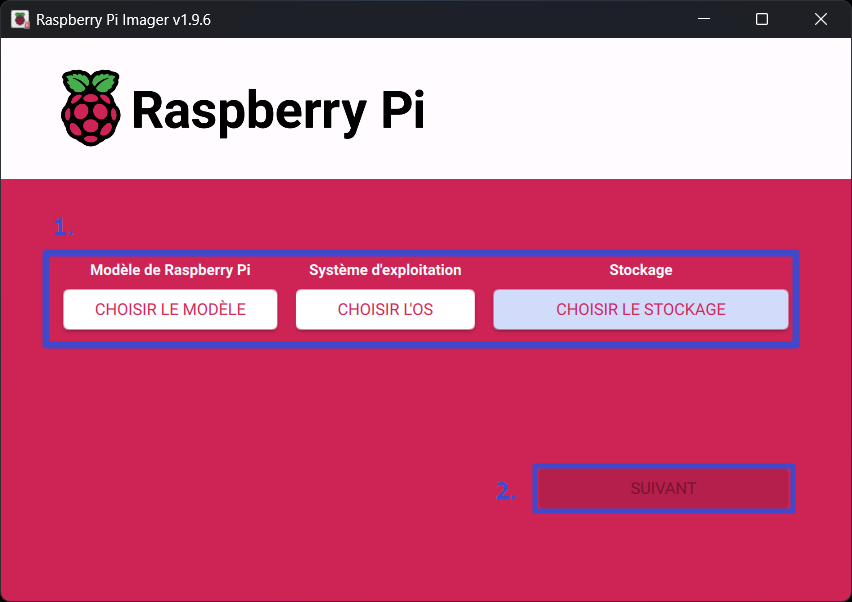
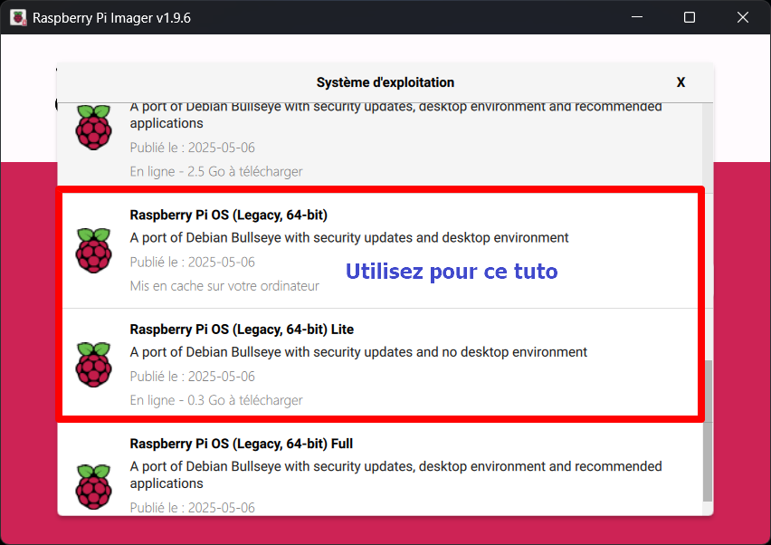
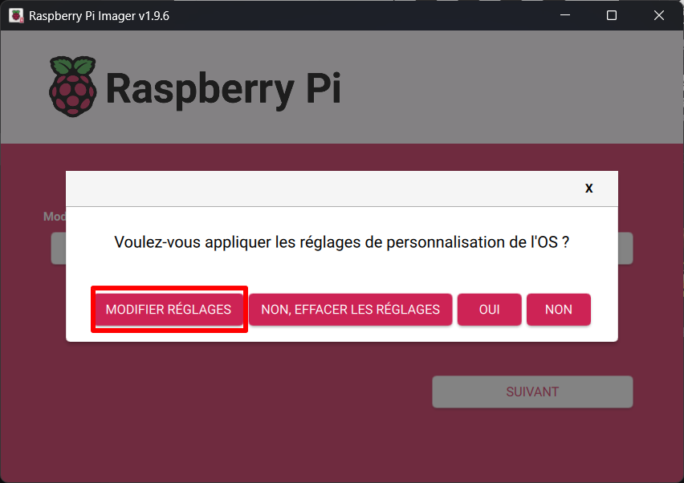
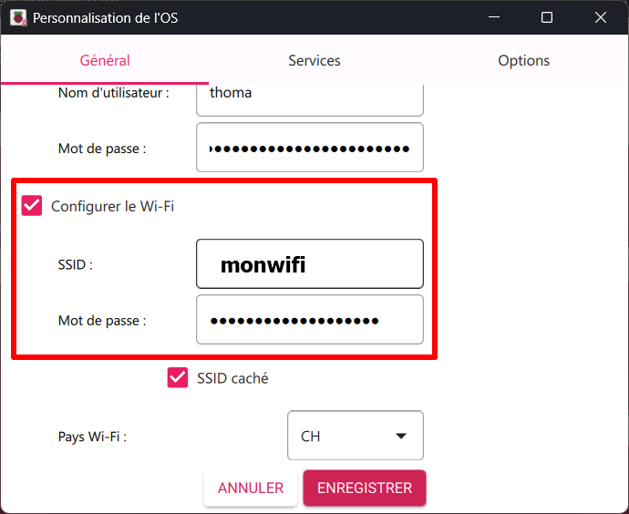
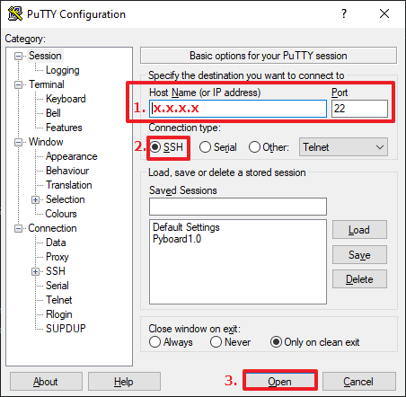
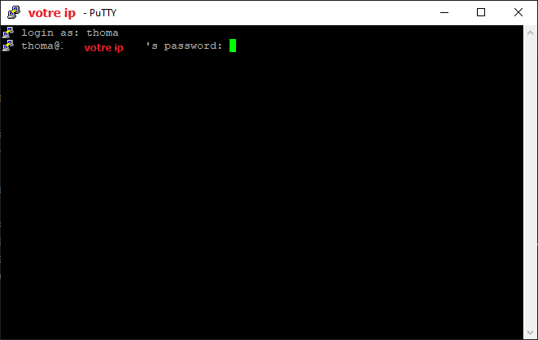
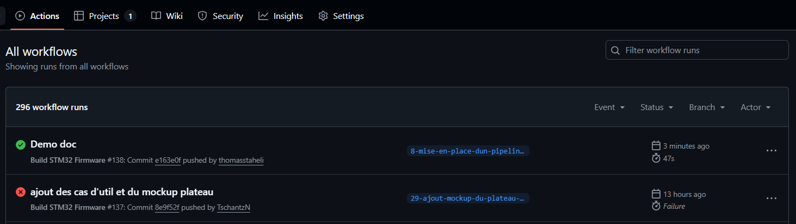

# Mise en place de l'auto-déploiement et des tests unitaires

## Objectif de la mise en place

Pouvoir compiler et flasher un fichier binaire pour un STM32, ainsi que tester celui-ci à distance.

## Matériels nécessaires

Voici la liste du matériel nécessaire pour pouvoir effectuer ce tutoriel de A à Z.

- 1x Raspberry Pi 3 ou +
- 1x Carte Nucleo ou un STM32
- 1x Programmeur STK-LINK

## Version

- La création du projet STM32 a été faite sur une machine `Windows 11` à l'aide de l'application `STM32CubeIDE` version `1.19.0`.
- Le déploiement automatique s'est effectué sur un Raspberry Pi 3B+ avec une architecture `64 bits`.
- Une carte `Nucleo-L010RB` a été utilisée pour les tests de ce tutoriel.

## Câblage

1. Câbler le Raspberry Pi afin de l'alimenter en USB.
2. Câbler votre carte Nucleo ou STM32 à l'aide d'un port USB disponible sur votre Raspberry Pi.

## Mise en place de l'OS du Raspberry Pi

Cette étape est importante, car il est nécessaire d'utiliser un OS 64 bits pour établir cette mise en place. Pour flasher la SD, il existe un logiciel simple d'utilisation [Raspberry Pi Imager](https://www.raspberrypi.com/software/).

1. Pour pouvoir flasher la SD, il faut d'abord choisir le modèle, puis le système d'exploitation et le stockage (la SD). Nous allons parcourir ces étapes en détail ci-dessous



2. Commencez par choisir le modèle de Raspberry Pi
3. Ensuite sélectionner le système d'exploitation, comme ci-dessous



4. Sélectionnez la SD
5. Maintenant, on continue en appuyant sur `Suivant`
6. Une petite fenêtre s'ouvre de réglage, appuyez sur `Modifier` :



7. Il faut désormais setup le wifi pour pouvoir utiliser SSH



8. Ensuite, il faut se diriger sous l'onglet `Services` et cocher `Activer SSH`


9. Ensuite appuyez sur `Enregistrez`, puis sur `Oui`
10. Continuez jusqu'à flasher votre SD.

## Connexion en SSH

Insérez la SD dans votre Raspberry Pi et alimentez le. Lorsque tout cela est fait, on peut y accéder en SSH (il se peut que cela prenne un peu de temps après avoir alimenté le Raspberry Pi).
Pour se faire, on peut utiliser par exemple PUTTY qui est un outil simple à prendre en main :



Etapes :
1. Spécifiez l'adresse IP du Raspberry Pi. Si vous avez du mal à trouver l'IP de votre Raspberry, vous pouvez utiliser un outil tel que Angry Ip Scanner qui vous permet de scanner tout votre réseau.
2. Sélectionne SSH comme connection type.
3. Appuie sur `Open`.

Une fenêtre similaire doit s'afficher qui vous demande votre nom d'utilisateur ainsi que votre mot de passe que vous avez configuré lors du setup de l'OS :

 

Vous êtes désormais connecté sur votre Raspberry Pi.

## Installation

Il faut désormais télécharger tous les outils nécessaires pour compiler et flasher le microcontrôleur :

```bash
$ sudo apt install -y \
    ca-certificates \
    curl \
    gnupg \
    lsb-release \
	pytest \
	python3-serial
```

Ensuite on continue avec la toolchain et `openocd` qui va nous permettre de flasher notre micro en ligne de commande :

```bash
$ sudo apt update
$ sudo apt install gcc-arm-none-eabi make cmake -y
$ sudo apt install openocd
```

### Mise à jour de la toolchain

Dans la plupart des cas, votre toolchain ne sera pas à jour. Il est important de mettre à jour celle-ci, sinon vous ne pourrez pas compiler votre projet STM32.

```bash
$ wget https://developer.arm.com/-/media/Files/downloads/gnu/13.3.rel1/binrel/arm-gnu-toolchain-13.3.rel1-aarch64-arm-none-eabi.tar.xz
$ tar -xf arm-gnu-toolchain-13.3.rel1-aarch64-arm-none-eabi.tar.xz
$ sudo mv arm-gnu-toolchain-13.3.rel1-aarch64-arm-none-eabi /opt/
$ export PATH=/opt/arm-gnu-toolchain-13.3.rel1-aarch64-arm-none-eabi/bin:$PATH
```

Vous pouvez vérifier que la procédure a bien fonctionné en faisant la commande suivante :

```bash
 $ arm-none-eabi-gcc --version
```

Le résultat suivant devrait apparaître :

```bash
arm-none-eabi-gcc (Arm GNU Toolchain 13.3.Rel1 (Build arm-13.24)) 13.3.1 20240614
Copyright (C) 2023 Free Software Foundation, Inc.
This is free software; see the source for copying conditions.  There is NO
warranty; not even for MERCHANTABILITY or FITNESS FOR A PARTICULAR PURPOSE.
```

### Compilation et Makefile

Maintenant que notre toolchain est à jour, on va pouvoir compiler notre projet STM32. Voici l'arborescence de notre projet créer depuis STM32 Cube IDE (version 1.19.0):

```txt
Firmware_anywherechess/         # Racine du projet
├── .settings/                  # Config Eclipse (propre à CubeIDE)
│
├── Core/                       # Code applicatif
│   ├── Inc/                    # Headers (main.h, stm32xx_hal_conf.h, ...)
│   └── Src/                    # Sources (main.c, stm32xx_it.c, system_stm32xx.c, ...)
│
├── Debug/
│   ├── Core/                       # Copie compilée de ton code Core (objets intermédiaires)
│   ├── Drivers/STM32L4xx_HAL_Driver/Src/   # Objets compilés du HAL
│   ├── Firmware_anywherechess.elf  # Binaire final (exécutable ELF pour STM32)
│   ├── Firmware_anywherechess.list # Listing assembleur + C
│   ├── Firmware_anywherechess.map  # Carte mémoire générée par l’éditeur de liens
│   ├── makefile                    # Script de build généré par CubeIDE
│   ├── objects.list                # Liste des objets compilés
│   ├── objects.mk                  # Dépendances pour make
│   └── sources.mk                  # Liste des sources du projet
│
├── Drivers/                    # HAL + CMSIS
│   ├── CMSIS/
│   └── STM32L4xx_HAL_Driver/
│
├── doc/                        # Dossier optionnel (documentation)
│
├── .cproject                   # Config projet Eclipse (CubeIDE)
├── .mxproject                  # Config CubeMX
├── .project                    # Config projet Eclipse
│
├── Firmware_anywherechess Debug.launch  # Config de lancement/debug
├── Firmware_anywherechess.ioc           # Fichier CubeMX (config pinout, clocks, périphériques)
│
└── STM32L432KCUX_FLASH.ld      # Script de linkage (mémoire Flash/RAM du MCU)
```

Dans cette arborescence, nous allons toucher à quelques fichiers, notamment au makefile. Pour se faire, il suffit de reprendre le makefile généré par l'IDE (et oui il faut ignorer la ligne 2 du makefile) :

On commence par se déplacer dans le bon répertoire :

```bash
cd my_stm32_project/Debug
nano makefile
```

Le makefile ci-dessous est basé sur le makefile généré par l'IDE (sur Windows), cependant il a été modifié pour qu'il fonctionne sur l'architecture cible :

```makefile
################################################################################
# Automatically-generated file. Do not edit!
# Toolchain: GNU Tools for STM32 (13.3.rel1)
################################################################################

-include ../makefile.init

RM := rm -rf

# All of the sources participating in the build are defined here
-include sources.mk
-include Drivers/STM32L0xx_HAL_Driver/Src/subdir.mk
-include Core/Startup/subdir.mk
-include Core/Src/subdir.mk
-include objects.mk

ifneq ($(MAKECMDGOALS),clean)
ifneq ($(strip $(S_DEPS)),)
-include $(S_DEPS)
endif
ifneq ($(strip $(S_UPPER_DEPS)),)
-include $(S_UPPER_DEPS)
endif
ifneq ($(strip $(C_DEPS)),)
-include $(C_DEPS)
endif
endif

-include ../makefile.defs

OPTIONAL_TOOL_DEPS := \
$(wildcard ../makefile.defs) \
$(wildcard ../makefile.init) \
$(wildcard ../makefile.targets) \


BUILD_ARTIFACT_NAME := firmware
BUILD_ARTIFACT_EXTENSION := elf
BUILD_ARTIFACT_PREFIX :=
BUILD_ARTIFACT := $(BUILD_ARTIFACT_PREFIX)$(BUILD_ARTIFACT_NAME)$(if $(BUILD_ARTIFACT_EXTENSION),.$(BUILD_ARTIFACT_EXTENSION),)

# Add inputs and outputs from these tool invocations to the build variables 
EXECUTABLES += \
firmware.elf \

MAP_FILES += \
firmware.map \

SIZE_OUTPUT += \
default.size.stdout \

OBJDUMP_LIST += \
firmware.list \


# All Target
all: main-build

# Main-build Target
main-build: firmware.elf secondary-outputs

firmware.elf: $(OBJS) $(USER_OBJS) ../STM32L010RBTX_FLASH.ld makefile objects.list $(OPTIONAL_TOOL_DEPS)
	arm-none-eabi-gcc -o "firmware.elf" @"objects.list" $(USER_OBJS) $(LIBS) \
	-mcpu=cortex-m0plus \
	-T"../STM32L010RBTX_FLASH.ld" \
	--specs=nosys.specs -Wl,-Map="firmware.map" -Wl,--gc-sections \
	-static --specs=nano.specs -mfloat-abi=soft -mthumb \
	-Wl,--start-group -lc -lm -Wl,--end-group
	@echo 'Finished building target: $@'
	@echo ' '

# le .map est produit en même temps que l’elf
firmware.map: firmware.elf
	@echo 'Generated map file: $@'

default.size.stdout: $(EXECUTABLES) makefile objects.list $(OPTIONAL_TOOL_DEPS)
	arm-none-eabi-size  $(EXECUTABLES)
	@echo 'Finished building: $@'
	@echo ' '

firmware.list: $(EXECUTABLES) makefile objects.list $(OPTIONAL_TOOL_DEPS)
	arm-none-eabi-objdump -h -S $(EXECUTABLES) > "firmware.list"
	@echo 'Finished building: $@'
	@echo ' '

# Other Targets
clean:
	-$(RM) default.size.stdout firmware.elf firmware.list firmware.map
	-@echo ' '

secondary-outputs: $(SIZE_OUTPUT) $(OBJDUMP_LIST)

fail-specified-linker-script-missing:
	@echo 'Error: Cannot find the specified linker script. Check the linker settings in the build configuration.'
	@exit 2

warn-no-linker-script-specified:
	@echo 'Warning: No linker script specified. Check the linker settings in the build configuration.'

.PHONY: all clean dependents main-build fail-specified-linker-script-missing warn-no-linker-script-specified

-include ../makefile.targets
```

On peut désormais faire la commande pour compiler le projet et nous donner notre `.elf` :

```bash
make all
```

Cependant, j'ai eu une erreur lors de la compilation qui m'a obligé à retirer un argument de compilation, soit l'argument `fcyclomatic-complexity`.

L'erreur :

```bash
arm-none-eabi-gcc: error: unrecognized command line option '-fcyclomatic-complexity'
make: *** [Drivers/STM32L0xx_HAL_Driver/Src/subdir.mk:64: Drivers/STM32L0xx_HAL_Driver/Src/stm32l0xx_hal.o] Error 1
```

Pour cela il faut retirer cette argument dans tous les fichiers `.mk` :

```bash
find . -name "*.mk" -exec sed -i 's/-fcyclomatic-complexity//g' {} +
make all
```

Si tout s'est bien passé, on a un message semblable à celui-ci à la fin du build:

 ```bash
(beaucoup beaucoup de prompt ...)

arm-none-eabi-objdump -h -S firmware.elf  > "firmware.list"
Finished building: firmware.list
```

### Flasher

On a désormais notre fichier `.elf` à disposition, mais avant de continuer, il faut trouver quel est votre fichier config nécessaire pour le STM que vous utilisez, par exemple :

```bash
STM32F1 → stm32f1x.cfg
STM32F0 → stm32f0x.cfg
STM32F3 → stm32f3x.cfg
STM32F4 → stm32f4x.cfg
STM32L4 → stm32l4x.cfg
```

Donc, un autre exemple, si j'ai le `STM32L010RBT6`, alors je sais que je dois prendre le fichier de config `target/stm32l0.cfg`

Maintenant, il vous reste plus qu'à flasher votre STM32 avec la commande suivante (exemple avec le `STM32L010RBT6`) :

```bash
$ sudo openocd -f interface/stlink.cfg -f target/stm32l0.cfg \
  -c "program firmware.elf verify reset exit"
```

Le résultat suivant doit s'afficher (fin du prompt) :

```bash
(...)
Info : Device: STM32L0xx (Cat.5)
Info : STM32L flash has dual banks. Bank (0) size is 64kb, base address is 0x8000000
** Programming Finished **
** Verify Started **
** Verified OK **
** Resetting Target **
Info : Unable to match requested speed 300 kHz, using 240 kHz
Info : Unable to match requested speed 300 kHz, using 240 kHz
shutdown command invoked
```

firmware.elf correspond au fichier binaire généré lors de la compilation de votre projet.

## Créer un Runner sur GitHub

Pour créer un Runner, vous avez toute la documentation nécessaire se trouvant sous l'onglet `Actions`, puis appuyez sur `New Runner`

1. Création d'un folder
```bash
mkdir actions-runner && cd actions-runner
```
2. Download de la dernière version du package runner (Pour avoir la dernière version du package dirigez vous sous l'onglet `Actions`)
```bash
curl -o actions-runner-linux-arm64-2.328.0.tar.gz -L https://github.com/actions/runner/releases/download/v2.328.0/actions-runner-linux-arm64-2.328.0.tar.gz
```
3. Validation du hash (Optionnel)
```bash
echo "b801b9809c4d9301932bccadf57ca13533073b2aa9fa9b8e625a8db905b5d8eb  actions-runner-linux-arm64-2.328.0.tar.gz" | shasum -a 256 -c
```
4. Extraction de l'installer 
```bash
tar xzf ./actions-runner-linux-arm64-2.328.0.tar.gz
```
5. Création du runner et démarage de la configuration
```bash
./config.sh --url <url_repo> --token <token_id>
```
Exemple :
```bash
./config.sh --url https://github.com/GianniCecchetto/ChessAnywhere --token AAAADDDDDCCCCCCCEEEEEE1111111
```
6. Lancement du Runner
```bash
./run.sh
```

Votre Raspberry fonctionne désormais comme Runner sur GitHub, lorsque vous effecturez des modifications sur le répertoire, l'auto-déploiement sera lancé.

## Automatisation de la compilation et du flash avec le Runner

Maintenant que notre Runner est en place, il faut lui indiquer qu'est-ce qu'il doit faire lorsque des modifications ont lieu sur le repository.

Pour se faire, il faut avoir un répertoire `.github/workflows` dans notre répertoire git. Dans `.github/workflows`, on y insère notre fichier `.yml` qu'on peut nommer par exemple `stm32-ci.yml`. Il faut désormais insérer toute la procédure de compilation, ainsi que de flash pour que ces commandes s'exécutent après une modification dans notre dossier `stm32-app/` ait lieu. Les tests automatiques ne seront donc pas lancés, si vous effectuez des modifications dans un autre dossier que celui spécifié dans le fichier `.yml`.

Voici un exemple d'un fichier `.yml` a inséré dans le répertoire `.github/workflows` :

```yml
name: Build STM32 Firmware

on:
  push:
	# Si un push a lieu dans le fichier stm32-app
    paths: ["stm32-app/**"]
  pull_request:
    # Si un push a lieu dans le fichier stm32-app
    paths: ["stm32-app/**"]

jobs:
  build-flash:
    runs-on: self-hosted

    steps:
      # Step 1: Checkout le repo et pull de la branche
      - name: Checkout repository
        uses: actions/checkout@v4
        with:
          fetch-depth: 0
          ref: ${{ github.ref }}

      # Step 2: Set up de la ARM toolchain
      - name: Setup ARM toolchain
        run: echo "/opt/arm-gnu-toolchain-13.3.rel1-aarch64-arm-none-eabi/bin" >> $GITHUB_PATH

      # Step 3: Build STM32 project
      - name: Build STM32 project
        working-directory: stm32-app/Debug
        run: |
          find . -name "*.mk" -exec sed -i 's/-fcyclomatic-complexity//g' {} +
          make all

      # Step 4: Flash le STM32 (si l'hardware est existant)
      - name: Flash STM32
        if: ${{ runner.os == 'Linux' }}
        working-directory: stm32-app/Debug
        run: |
          openocd -f interface/stlink.cfg -f target/stm32l0.cfg \
                  -c "program firware.elf verify reset exit"

      # Step 5 : Exécute les tests automatisés se trouvant dans stm32-app/test à l'aide de pytest (à vous de définir vos tests)
      # Partie pas obligatoire, mais elle permet d'effectuer des "tests unitaires" sur le programme de votre microcontrôleur
      # Si vous désirez seulement compiler et flasher, alors enlever cette section
      - name: Python test STM32
        run: python3 -m pytest stm32-app/test -v
        env:
          PYTHONPATH: stm32-app        
```

Sauvegarder votre fichier `.yml` et pusher le dans votre répertoire.

## Auto-démarage du runner (Optimisation donc Optionnel)

Actuellement, si l'on souhaite que notre Raspberry Pi tourne en tant que Runner, il est nécessaire de s'y connecter en SSH ou en USB et de lancer la commande :

```bash
$ ~/actions-runners $ ./run.sh
```

ce qui nécessite qu'une machine soit toujours connecté avec une session SSH active.

Cependant, il est possible de programmer cette commande au démrage du Raspberry Pi, afin de ne pas avoir une machine connectée en continu au Raspb. Pour se faire, il suffit :

1. Créez un fichier de service :
```bash
$ sudo nano /etc/systemd/system/runner.service
```
2. Dans ce fichier, on insère (adaptez, si nécessaire `WorkingDirectory`, `ExecStart` et `User`) :
```bash
[Unit]
Description=GitHub Actions Runner
After=network.target

[Service]
Type=simple
User=raspberrypi
WorkingDirectory=/home/raspberrypi/actions-runner
Environment=PATH=/opt/arm-gnu-toolchain-13.3.rel1-aarch64-arm-none-eabi/bin:/usr/local/bin:/usr/bin:/bin
ExecStart=/home/raspberrypi/actions-runner/run.sh
Restart=always

[Install]
WantedBy=multi-user.target
```
3. Rechargez systemd :
```bash
$ sudo systemctl daemon-reload
```
4. Activez votre service au démarrage :
```bash
$ sudo systemctl enable runner.service
```
5. Démarrez-le immédiatement pour tester :
```bash
$ sudo systemctl start runner.service
```
6. Vérifiez qu’il tourne :
```bash
$ systemctl status runner.service
```

Pour vérifier que tout fonctionne correctement, il suffit de reboot notre Raspberry Pi :
```bash
$ sudo reboot
```

## Test de fonctionnement

Avant de commencer le test, assurez-vous que votre Raspberry est bien entrain de jouer son rôle de Runner. Si ce n'est pas le cas, lancer le Runner avec la commande :

```bash
~/actions-runners $ ./run.sh
```

Ensuite, modifier un fichier de votre répertoire que vous avez spécifié dans le worflow `.yml`, par exemple on peut modifier le `main.c` dans `Core/Src`. Pour tester on peut simplement ajouter un caractère espace dans le code.

Puis, on enregistre nos modifications et on push sur le git.

```bash
$ git add Core/Src/main.c
$ git commit -m "Test intégration"
$ git push
```

Et maintenant lorsque des modifications sont push, le test automatique doit apparaître dans la section `Actions` du répertoire.

Exemple :



## Intégration des tests unitaires

Une méthode possible, pour tester votre programme du microcontrôleur, est d'utilisé l'UART ou la connexion USB pour dialoguer entre votre Raspberry Pi et votre STM32.

On peut écrire des tests unitaires avec la librairie `pytest`. Ainsi on peut simplement renvoyé des assert True ou False pour indiquer si le test a passé ou non.

Exemple d'un dialogue :

Trame UART envoyée par le Raspberry Pi :

```bash
UNIT_TEST
```

Le STM32 reçoit et effectue des tests en internes puis fini par renvoyer une donnée à valider :

```bash
DOOR_OPEN
```

Le Raspberry Pi reçoit la trame et vérifie que l'information est correct.


