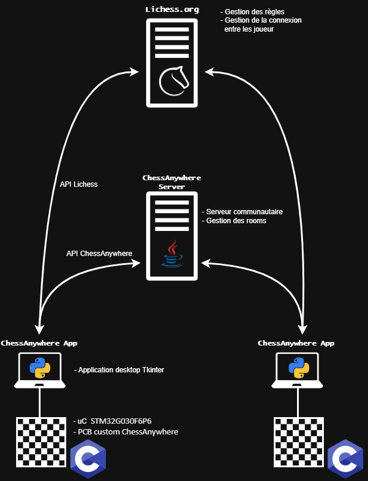

# Description de l'architecture

## L'architecture est composés de 4 éléments :

### 1) Échiquier
Il est composé de capteur magnétique pour la détection des pièces et de Led RGB pour l'indication des coup possible.
le tout est controlé par un microcontrolleur de type STM32G030F6P6. Ces éléments sont placé sur un PCB réalisé sur mesure. 

### 2) Application desktop
L'application sert d'interface entre l'échiquier et les 2 serveurs. Elle permet de visualiser les parties d'autre utilisateur de ChessAnywhere et de si connecter, de se connecter a un utilisateur Lichess en ligne et de gérer des parties locales en personnes. L'application se charge également de tracker l'état actuel de l'échiquier et de calculer les coup possible lorsque les pièces sont soulevée.

### 3) Serveur MQTT (ChessAnywhere)
Un serveur "communautaire" ChessAnywhere utilisant l'API ChessAnywhere gère la création de "Rooms" et conserve les informations nécessaire a la connection des joueurs au serveur Lichess 

### 4) Serveur Lichess.org
Lichess.org met a dispositon une API. cela permettra la communication des coups ,la détection de coup illégaux et la gestion global de la partie. La communication se fera directement entre l'application et Lichess.org. (Le serveur ChessAnywhere ne sert donc que de sysème de mise en relation)

