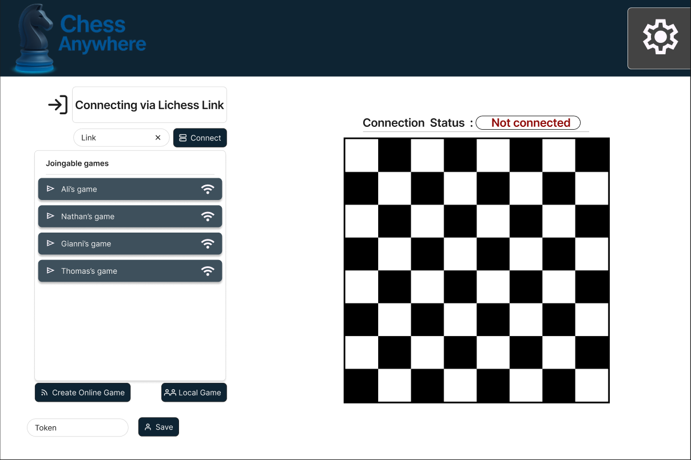
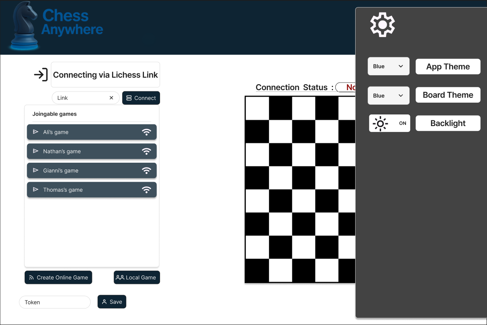
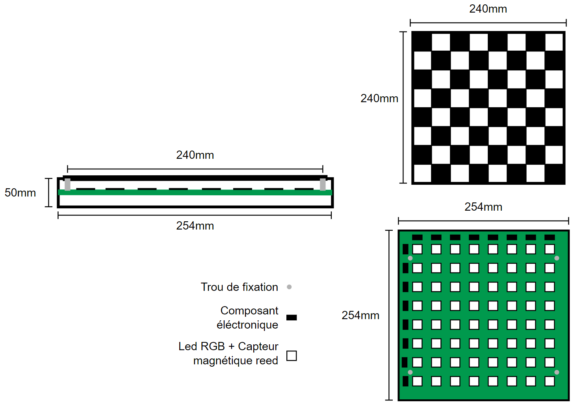
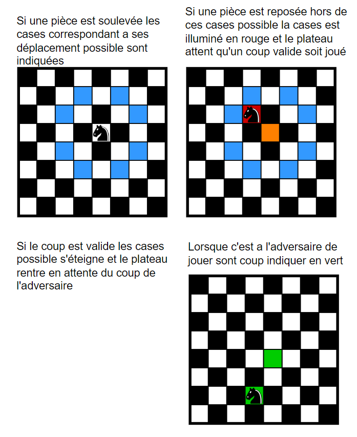

# Mockups de l'application et landing page
## Mockups de l'application
La page principale de l'application comprendra
- L'état actuel du plateau (position des pièces)
- L'état de la connection avec le plateau (Connection status)
- Un champ permettant de rentré le token pour la connexion a l'API Lichess
- Un champ permettant de rentré un lien Lichess pour ce connecté a une partie
  d'un joueur un ligne
- La liste des parties (rooms) hébéreger par notre server MQTT
- Un boutton permettant de lancer une partie local (versus physique)
- Un boutton permettant de lancer une partie en ligne (opposant Lichess ou AnywhereChess)
---

---

Quelques options de personnalisation sont misent a disposition dans l'onglet "settings".

---

## Mockups du plateau

