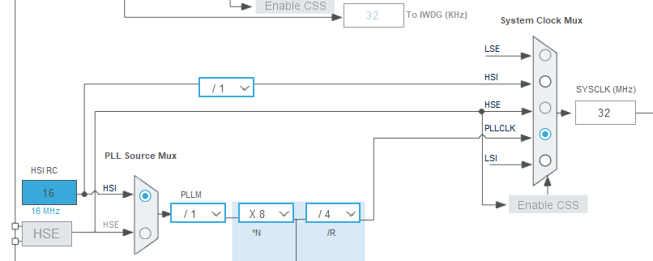

# Mise en place du Firmware

## Rôle du firmware

Dans le cadre de ce projet, le firmware a pour but de :

- Contrôler des leds RGB (64 leds)
  - Gestion de l'éclairage
  - Gestion des cases allumées
- Lire d'une matrice de switch reed (capteur magnétique)
  - Détection d'une pièce levée ou d'une pièce placée
- Etablir une communication UART
  - Décodage des commandes envoyées par l'application
  - Envoi des pièces placées / levée à l'application

## Microcontrôleur

Le firmware a été codé pour être flashé sur un microcontrôleur STM32G030F6PX. 
Sur notre prototype, nous avons décidé d'utilisé un STM32G030F6P6, qui est un petit STM avec une capacité de flash assez limitée de 32 kBytes. 
Puisque notre projet ne demande pas trop de pins, nous avons décidé de prendre la version 20 pins, soit le boitier TSSOP20.

## Ouverture du projet

Le fichier `.project` permet d'ouvrir le projet du firmware. 

### Spécifications de l'IDE
- Version utilisée : 1.19.0
- Développé sur Windows 11

Afin de facilité l'ouverture du projet, il est conseillé de placer le dossier `/firmware`, se trouvant à la racine de ce projet, dans le chemin suivant :
C:\Users\userName\STM32CubeIDE\workspace_1.19.0

Ensuite, pour importer le projet : `Clic droit` dans la zone `Project Explorer` se trouvant à gauche de l'écran -> `Import...` -> `General` 
-> `Existing Projects into Workspace` -> `Next >` -> `Browse...` -> `Sélectionner` le dossier `Firmware` -> `Finish`

Le project apparait désormais dans votre zone `Project Explorer`.

## Architecture `.ioc`

Normalement, vous n'aurez pas à modifier le fichier `firmware.ioc`, car celui-ci contient la pinout qui est directement dépendant de l'hardware de la carte. Voici à quoi ressemble le pinout :


On remarque que 4 pins sont libres et peuvent potentiellement être utilisées pour des futurs utilisations. Cependant, ces pins sont routées de la manière suivante sur le PCB :
- **PA0** : USART2_CTS pour le contrôleur USB FT231
- **PA1** : USART2_RTS pour le contrôleur USB FT231
- **PC14** : I2C1_SDA pour utilisation futur (pin relié à un pinheader, donc utilisation libre)
- **PB3** : I2C1_SCL pour utilisation futur (pin relié à un pinheader, donc utilisation libre)

> **Note :**  **PB7** est une entrée prévue pour un bouton, avec une résistance de pull-up intégrée dans le schéma. Ce bouton doit être connecté via le connecteur P9. Il n’a toutefois pas été utilisé dans la version 1 fonctionnelle du projet.

Voici quelques spécifications concernant le setup de l'ioc :

### Clock configuration



Nous utilisons la PLL interne du microcontrôleur pour obtenir une fréquence de 32 MHz, au lieu de la valeur par défaut de 16 MHz. Cette configuration s’est avérée nécessaire afin de garantir la gestion des LEDs RGB ainsi qu’une lecture stable des capteurs reed.

### Configuration du TIM17_CH1

#### Mode

- Activated
- Channel1 : PWM Generation CH1

#### Configuration

Dans `Parameter Settings` :

- Counter Settings
  - Prescaler = 0
  - Counter Mode = Up
  - Counter Period = 39 (valeur calculée selon la fréquence SYS_CLOCK qui est à 32 MHz)
  - Internal Clock Division = No division
  - RCR = 0
  - Auto-reload preload = Disable
- Break And Dead Time management - BRK
  - Tous par défaut
- Break And Dead Time management - Output Configuration
  - Tout disable ou OFF
- PWM Generation Channel 1
  - Mode = PWM mode 1
  - Pulse = 0
  - Output Compare preload = Enable
  - Fast Mode = Disable
  - CH Polarity = High
  - CH Idle States = Reset

Dans `DMA Settings` :

| DMA Request | Channel | Direction | Priority |
|---------------------------|-----------|-----|-------|
| TIM17_CH1   | DMA1 Channel 1 | Memory To Peripheral   | Medium |

- DMA Request Settings
  - Mode = Normal
  - Increment Adress : Only Memory
  - Data Width : Half Word

Tous le reste par défaut   

Dans `NVIC Settings` :

| NVIC Interrupt Table | Enabled | Preemption Priority |
|---------------------------|-----------|-----|
| DMA channel 1 interrupt   | Enabled   | 0   |
| TIM17 global interrupt    | Enabled   | 0   |

### Configuation de USART2

#### Mode

Mode = Asynchronous
Hardware Flow Control RS232 et RS485 = Disable

#### Configuration 

Dans `Parameter Settings` :

- Basic Parameters
  - Baud Rate = 115200
  - Word Length = 8 Bits
  - Parity = None
  - Stop Bits = 1
- Advanced Parameters
  - Tous par défaut
- Advanced Features
  - Overrun : Enabled
  - DMA on RX Error : Enabled
  - Le reste disabled

Dans `NVIC Settings` :

| NVIC Interrupt Table | Enabled | Preemption Priority |
|---------------------------|-----------|-----|
| USART2 global interrupt / USART2 wake-up interrupt through EXT1 line | Enabled   | 0   |

## Compilation

Avant de compiler le projet, il est nécessaire d’activer une optimisation de compilation afin que le code tienne dans la mémoire Flash du microcontrôleur.
Pour se faire, il faut activer le paramètre `Optimize for size (-Os)` au chemin suivant : `Project` -> `Properties` -> `v C/C++ Build` -> `Settings` -> `MCU/MPU GCC Compiler` -> `Optimization`
et dans le champ `Optimization level`, on sélectionne `Optimize for size (-Os)`, puis `Apply and Close`.

Maintenant que le paramètre est bien activé, on lance lance le build dans : `Project` -> `Build All` 

On doit avoir un résultat similaire à celui-ci, dans la console :

```bash
make -j20 all 
arm-none-eabi-gcc "../Core/Src/main.c" -mcpu=cortex-m0plus -std=gnu11 -g3 -DDEBUG -DUSE_HAL_DRIVER -DSTM32G030xx -c -I../Core/Inc -I../Drivers/STM32G0xx_HAL_Driver/Inc -I../Drivers/STM32G0xx_HAL_Driver/Inc/Legacy -I../Drivers/CMSIS/Device/ST/STM32G0xx/Include -I../Drivers/CMSIS/Include -Os -ffunction-sections -fdata-sections -Wall -fstack-usage -fcyclomatic-complexity -MMD -MP -MF"Core/Src/main.d" -MT"Core/Src/main.o" --specs=nano.specs -mfloat-abi=soft -mthumb -o "Core/Src/main.o"
arm-none-eabi-gcc -o "firmware.elf" @"objects.list"   -mcpu=cortex-m0plus -T"C:\Users\thoma\STM32CubeIDE\workspace_1.19.0\firmware\STM32G030F6PX_FLASH.ld" --specs=nosys.specs -Wl,-Map="firmware.map" -Wl,--gc-sections -static --specs=nano.specs -mfloat-abi=soft -mthumb -Wl,--start-group -lc -lm -Wl,--end-group
Finished building target: firmware.elf
 
arm-none-eabi-size  firmware.elf 
arm-none-eabi-objdump -h -S firmware.elf  > "firmware.list"
   text	   data	    bss	    dec	    hex	filename
  19320	    124	   3260	  22704	   58b0	firmware.elf
Finished building: default.size.stdout
 
Finished building: firmware.list
 

22:30:07 Build Finished. 0 errors, 0 warnings. (took 3s.869ms)
```

## Flash

Pour programmer le microcontrôleur *STM32G030F6P6*, il est nécessaire d’utiliser un programmateur **ST-LINK** ou tout autre outil compatible **SWD (Serial Wire Debug)**.  

Le programmateur doit être connecté au connecteur **P8** avec le pinout suivant :

| Broche | Signal | Description                  |
|--------|---------|------------------------------|
| 1      | SWCLK   | Horloge du débogueur SWD     |
| 2      | SWIO    | Données du débogueur SWD     |
| 3      | 3V3     | Alimentation 3,3 V           |
| 4      | NRST    | Reset du microcontrôleur     |
| 5      | GND     | Masse                        |


Ensuite, lorsque votre programmeur est connecté, flasher le microcontroleur en appuyant sur `Run firmware`.
